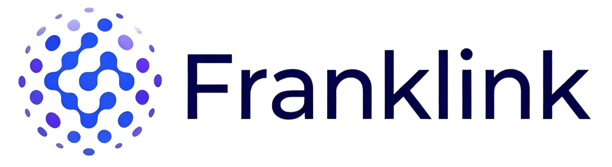
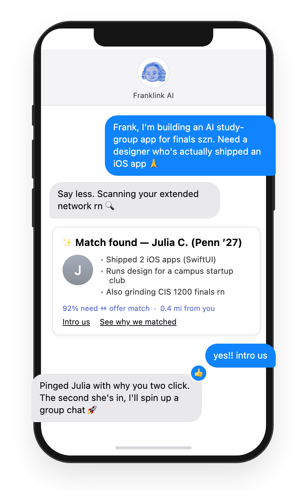
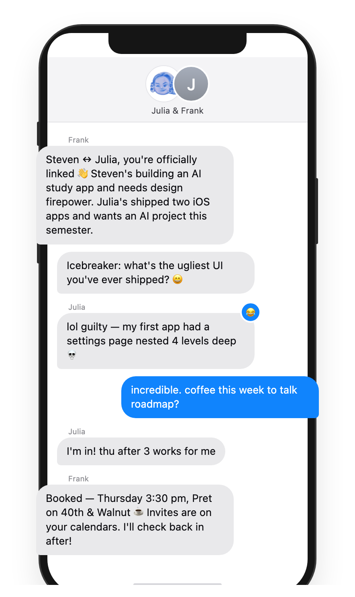
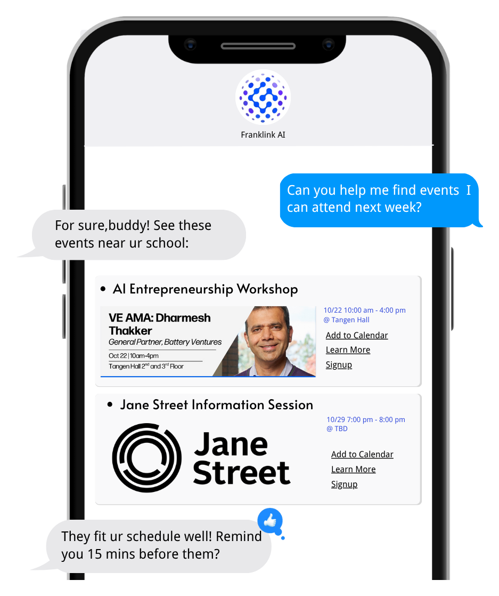
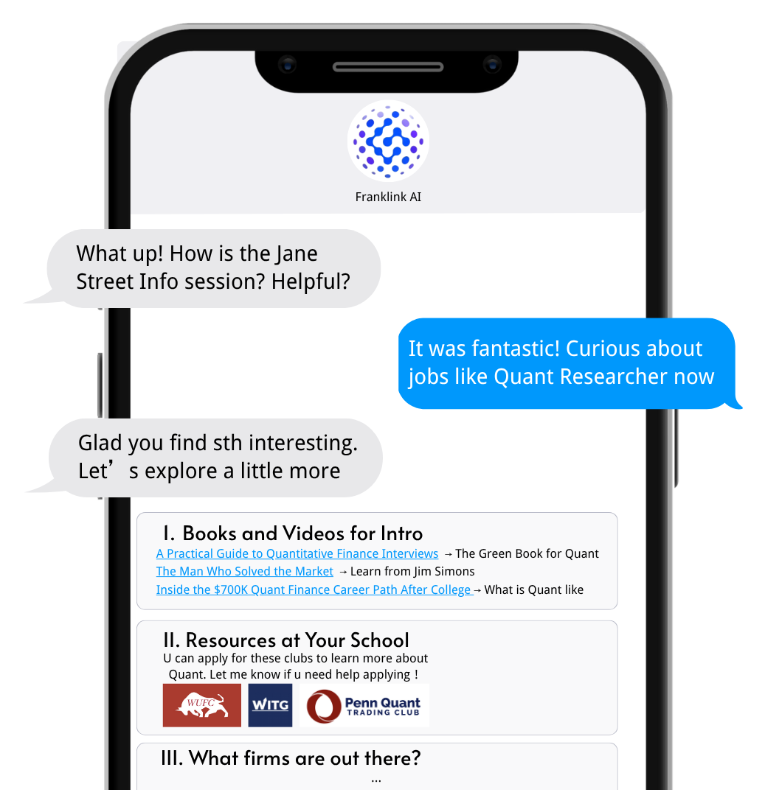
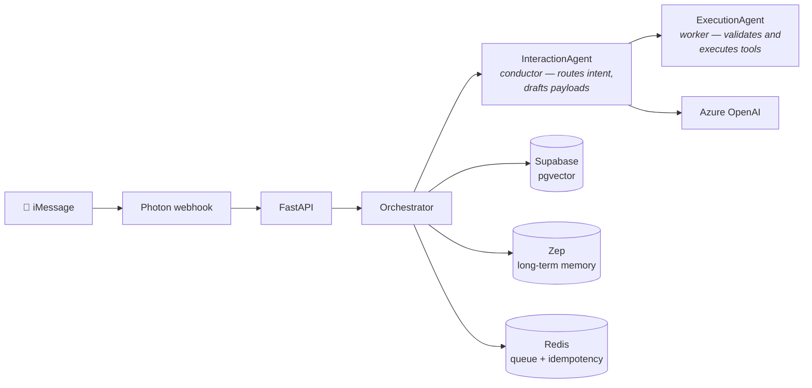

<div align="center">

<picture>
  <source media="(prefers-color-scheme: dark)" srcset="docs/assets/banner-dark.png">
  
</picture>

### Text Frank like a friend. He finds the people you need — and puts you in the same chat.


**Avalanche Team 1 × foundry · Start-Up In a Weekend Hackathon 2025**


</div>

---


**Franklink** is an AI networking concierge that lives entirely inside **iMessage**. There is no app to install and no feed to scroll. You text **Frank** the way you'd text a friend; he figures out what you need, finds another user who has it, gets consent from both sides, and drops everyone into a small group chat — icebreaker already written, follow-ups handled.

We built it in one weekend because we kept watching the same thing happen on campus: everyone *wants* to network, nobody wants to open LinkedIn. But everyone answers their texts.

> *It's the first chat that becomes your startup. The first chat where interview questions actually get shared. The first chat with the people grinding finals with you at 2 a.m.*

## Demo

<table>
  <tr>
    <td width="50%" align="center">
      <br>
      <b>1 · Ask for what you need</b><br>
      <sub>Frank extracts your need, embeds it, and matches it against every other user's offers — ranked by fit and distance.</sub>
    </td>
    <td width="50%" align="center">
      <br>
      <b>2 · Get introduced, not ghosted</b><br>
      <sub>Both sides say yes → Frank spins up a three-way chat, writes a context-rich icebreaker, and books the coffee.</sub>
    </td>
  </tr>
  <tr>
    <td width="50%" align="center">
      <br>
      <b>3 · Never miss the room</b><br>
      <sub>Frank surfaces events near you that fit your goals <i>and</i> your calendar, then reminds you before they start.</sub>
    </td>
    <td width="50%" align="center">
      <br>
      <b>4 · Level up between intros</b><br>
      <sub>Curated books, videos, and campus clubs, ranked against what Frank remembers about where you're headed.</sub>
    </td>
  </tr>
</table>

<div align="center"><sub><i>Screens are illustrative mockups of Franklink's live iMessage flows.</i></sub></div>

## What Frank does

| Capability | What you experience | How it works |
|---|---|---|
| **Need ↔ offer matching** | "I need someone who's shipped a Next.js app" → Frank introduces you to one. | A two-tier LLM pipeline extracts demands and offerings from every message, embeds them, and matches against other users' profiles (pgvector). |
| **AI-seeded group chats** | A three-way chat appears with a tailored icebreaker already written. | Once both users consent, Frank provisions the group via Photon, generates a context-rich opener, and stays in the chat to nudge, summarize, and follow up. |
| **Email-context intelligence** | Frank knows you're going to an AI conference because your ticket email said so. | Read-only Gmail signals via Composio are summarized into searchable highlights stored on each user's profile. |
| **Location-aware intros** | "Anyone near Berkeley this weekend?" actually finds people near you. | Handles resolve to coordinates per user; the matcher weighs distance as a ranking feature. |
| **Proactive outreach** | Frank circles back a day later to check in — never spammy. | Background workers reason over unresolved connections and inactivity windows and only speak when a follow-up adds value. |

## How it works

Two LangGraph agents, a stateless orchestrator, and a handful of background workers. No checkpoints — every turn rebuilds state from the database plus the incoming webhook.



Four flows are active in the router:

- **Onboarding** — name → school → career interests, with Photon reactions and a contact-card exchange
- **Networking** — match candidates on need / offer / location, confirm with the initiator, invite the target, seed the group chat
- **Recommendation** — books, videos, and resources from a curated catalog, ranked against Zep memory
- **General** — casual chat with fast-path acknowledgements when no deeper action is needed

Longer reads: [docs/ARCHITECTURE.md](docs/ARCHITECTURE.md) for the flow details, [docs/FRANK_SYSTEM_PROMPT.md](docs/FRANK_SYSTEM_PROMPT.md) for Frank's full persona and mode system (users control how chatty he's allowed to be), and [docs/EMAIL_EXTRACTION.md](docs/EMAIL_EXTRACTION.md) for the Gmail pipeline.

## Built in a weekend

Everything below went from zero to working demo during the hackathon:

- 📱 A live iMessage agent on a real phone number (Photon bridge — typing indicators, tapbacks, group provisioning)
- 🤝 Need/offer extraction and embedding-based matching with location as a ranking signal
- 👥 Fully automated three-way group-chat creation with generated icebreakers
- 📧 Read-only Gmail signal extraction (Composio) feeding the match profile
- ⏰ Proactive follow-up workers that decide *whether* a nudge adds value, not just when
- 🧠 Long-term per-user memory (Zep) so Frank remembers goals across conversations

Why iMessage? Because the demo lives where users already are: no install step, no new account, notifications that actually get read — and group chats are the native unit of collaboration.

## Stack

- **Runtime** — Python 3.11 · FastAPI · Uvicorn · Supervisor (background workers)
- **Agents** — LangGraph, stateless per turn (state rebuilt from DB + webhook)
- **Models** — Azure OpenAI (`gpt-5-mini` for interaction and reasoning)
- **Data** — Supabase (Postgres + pgvector) · Zep · Redis
- **Messaging** — Photon iMessage bridge
- **Integrations** — Composio (Gmail) · Stripe helpers · optional LinkedIn enrichment (BrightData / Scrapingdog)

## Quick start

Prerequisites: Python 3.11+, a Supabase project, an Azure OpenAI deployment, a Photon account, and a Zep workspace. Docker is optional.

```bash
git clone https://github.com/StevenWang-CY/Franklink.git
cd Franklink

python -m venv venv
source venv/bin/activate
pip install -r requirements.txt

cp .env.example .env
#  ↑ fill in Azure OpenAI, Supabase, Redis, Photon, Zep, Composio (others optional)

#  Apply the database schema (see db/MIGRATION_ORDER.md for the correct order)
psql "$POSTGRES_CONNECTION_STRING" -f db/schema/user_profiles_table.sql
#  … repeat for every file listed in db/MIGRATION_ORDER.md

uvicorn app.main:app --reload
```

Or with Docker Compose:

```bash
docker compose up --build
```

## Repository layout

```
app/              FastAPI app, agents, tools, integrations, workers
db/
  MIGRATION_ORDER.md     Run these SQL files in this order on a fresh DB
  schema/                Supabase schema and RPC definitions
docs/
  ARCHITECTURE.md        LangGraph flow overview
  EMAIL_EXTRACTION.md    Composio-based Gmail extraction pipeline
  FRANK_SYSTEM_PROMPT.md Frank's persona and mode system
  UPDATE_TASK.md         Update flow ("dumb executor" pattern)
infrastructure/   Supervisord config for the container
scripts/          One-off operational scripts (Zep migrations, query experiments)
tests/            Pytest suite (group chat, location flow, etc.)
```

## Development

```bash
pytest                    # run the test suite
pytest tests/groupchat    # scope to one package
```

## Security · Contributing · License

Found a vulnerability? Please don't open a public issue — see [SECURITY.md](SECURITY.md) for private reporting. Contributions are welcome via [CONTRIBUTING.md](CONTRIBUTING.md); all contributors follow the [Code of Conduct](CODE_OF_CONDUCT.md).

[MIT](LICENSE) © Franklink

---

<div align="center">
<sub>Built in one weekend, on very little sleep, by <b>Avalanche Team 1</b> 🏔️</sub>
</div>
